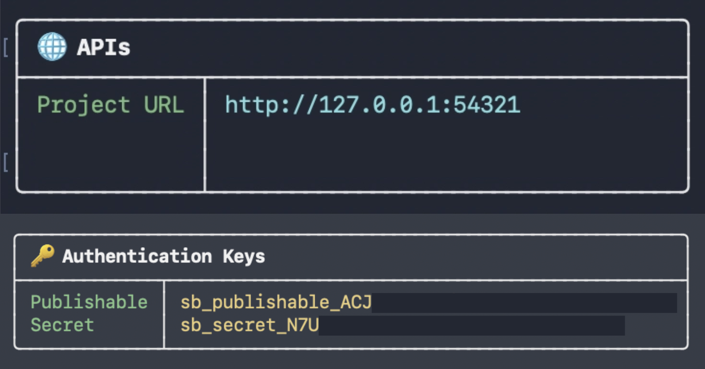

# Setting Up YDO Locally


This guide walks you through getting the project and development environment running on your machine. Read it fully before running any commands.

---

## Prerequisites

Make sure the following are installed before you begin:

- Node.js via nvm or volta (recommended)
- pnpm
- Docker (required for local Supabase)

> Make sure **Docker** is open and running before any **Supabase** commands.

---

## Steps

### 1. Fork and Clone

Fork the repository on GitHub, then clone your fork:

```bash

git clone https://github.com/<your-username>/YDO_26.git

cd YDO_26

```

Add the upstream remote so you can sync with the main repo later:

```bash

git remote add upstream https://github.com/bsoc-bitbyte/YDO_26.git

```

### 2. Install dependencies

```bash

pnpm install

```

### 3. Set Up Local Supabase

With Docker running, start Supabase:

```bash
pnpm dlx supabase start     # starts the local Supabase instance
```

> Note: Skip `pnpm dlx supabase init` if the `supabase/` directory already exists in the repository. Initialize it only otherwise.

From the output, you will need two values for the next step:



In case you want to revisit the same credentials, run

```bash

pnpm dlx supabase status

```

To stop Supabase when you are done:

```bash

pnpm dlx supabase stop

```

### 4. Configure Environment Variables

The project requires two separate env files. Create both in the locations below.

- ***`.env.local`*** (root directory): connects Next.js to your local Supabase instance:

```env

NEXT_PUBLIC_SUPABASE_URL=<Project URL>

NEXT_PUBLIC_SUPABASE_PUBLISHABLE_KEY=<publishable key>

```

- ***`supabase/.env`*** Google OAuth credentials for Supabase Auth:

To get OAuth credentials: go to Google Cloud Console, navigate to APIs & Services > Credentials, and create an OAuth 2.0 Client ID. Copy the client ID and secret into the fields below.

```env

SUPABASE_AUTH_GOOGLE_CLIENT_ID=<your-client-id>

SUPABASE_AUTH_GOOGLE_SECRET=<your-secret-key>

```

> Note: Auth is restricted to `@iiitdmj.ac.in` Google accounts in production. For local development, you can adjust this restriction in your local Supabase Auth settings.

### 5. Start the Development Server

```bash

pnpm run dev

```

Open http://localhost:3000 in your browser.

---

## Troubleshooting

- `supabase start` ***fails immediately***:

Docker is not running. Start it and try again.

- ***Environment variable errors on startup***:

Confirm `.env.local` exists in the root directory (not inside `app/`) and that both variables are filled in with values from the `supabase start` output.

- ***Out of sync with upstream***:

```bash

git fetch upstream

git rebase upstream/main

```